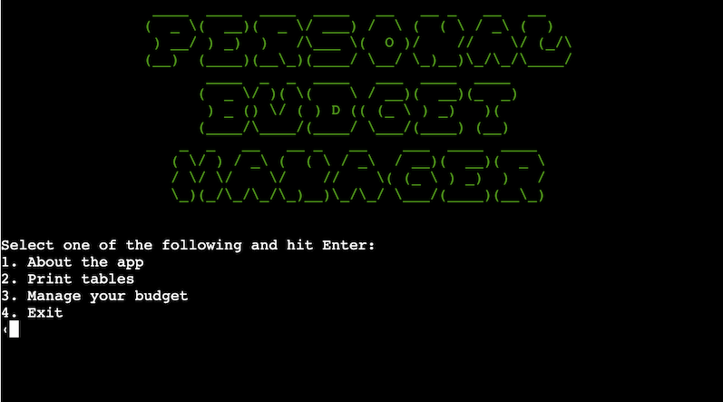
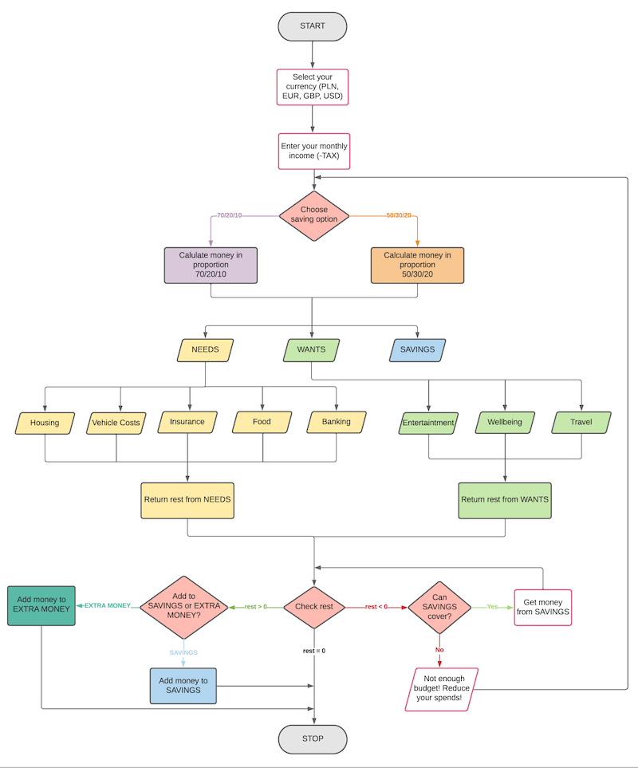
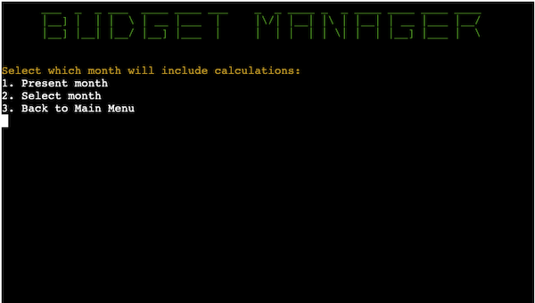
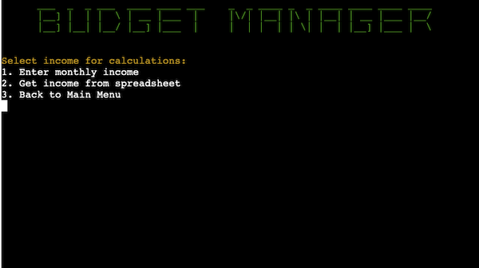

<h1 align="center">Personal Budget Manager</h1>

Personal Budget Manager is a product to plan monthly costs based on income. It can be used by regular user to manage his money and to encourage for investing and saving.

The entire program runs in terminal. Users can enter their income and plan their costs using two available investing plans. Money can be spread into default or custom categories. The program runs with Google Sheets which is used to store data in the spreadsheet.

All calculations are handled using Python language. Users enter data for processing and the result of calculation is returned in terminal or Google Sheets.

The program can be run [here](https://personal-budget-manager.herokuapp.com/).

<h2 align="center"></h2>

# Contents
- [Contents](#contents)
- [User Experience](#user-experience)
  - [User Stories](#user-stories)
  - [Logic flow](#logic-flow)
  - [Program Structure](#program-structure)
    - [Colour](#colour)
- [Features](#features)
  - [Main Menu](#main-menu)
  - [About the app](#about-the-app)
  - [Print tables](#print-tables)
  - [Manage the budget](#manage-the-budget)
  - [Exit](#exit)
  - [Future Features](#future-features)
- [Technologies Used](#technologies-used)
  - [Third Party Libraries](#third-party-libraries)
- [Testing](#testing)
- [Deployment](#deployment)
  - [Using Heroku to deploy the project.](#using-heroku-to-deploy-the-project)
  - [Fork a repository.](#fork-a-repository)
  - [Clone a repository.](#clone-a-repository)
- [Credits](#credits)
  - [Content](#content)
  - [Media](#media)
- [Acknowledgements](#acknowledgements)

# User Experience
## User Stories
-	As a user, I want to handle automate my budget calculations.
-	As a user, I want to have access to my data.
-	As a user, I want to edit my data if needed.
-	As a user, I want to run my program without crashing.
-	As a user, I want to be notified if I exceeded my budget.
-	As a user, I want to handle my debt if I exceed my budget.

## Logic flow
Logic flow was presented using [Lucidchart](https://www.lucidchart.com/pages/) to visualize how the program will run.

## Program Structure
Personal Budget Manager is run in terminal and Google Sheets. User inputs data through selection based on menu provided or by typing. All inputs are validated for proper program operation.

### Colour
Third party library [termcolor](https://pypi.org/project/termcolor/) was used to colour title heading in the terminal for enhanced UX. 

Green was selected, inspired by Matrix movie.

# Features

## Main Menu
The main menu is loaded when program starts and when user decides to restart.

1. About the app - this section can be accessed through main menu. It provides user with program operation brief description.

2. Print tables - users can see the most recently updated worksheets: General, Needs or Wants depending on the input.

3. Manage the budget - this section is starting point for all budget calulations. Step by step user is prompt to enter the data which will be handled depending on his choice.

4. Exit - if user decides to leave the program he can choose Exit and the program will be stopped.

## Month Selection

User is prompted to select month for his calculations:
1. Present month - calculations will be handled using Python datetime library to get present month from system.
2. Select month - user can select month for his calculations. The input is validated with list of months. If user puts invalid entry, the message is printed.

## Income Input

User is prompted to enter his monthly income:
1. Enter monthly income - user inputs his income manually. His input is validated - only float data type is allowed.
2. Get income from spreadsheet - data is fetched from worksheet based on last entry.

## Future Features

# Technologies Used
- [Python](https://www.python.org) - interpreted high-level general-purpose programming language used to build the entire application.
- [Gitpod](https://www.gitpod.io/#get-started) - cloud development platform to deploy website.
- [Github](https://github.com/) - code hosting platform to host the website.
- [Heroku](https://www.heroku.com) - container-based cloud Platform as a Service (PaaS). Developers use Heroku to deploy, manage, and scale modern apps.
- [LucidChart](https://www.lucidchart.com/) - intelligent diagramming application to create logic flow diagram.

## Third Party Libraries
- Gspread / Google Auth
- Pyfiglet
- Termcolor
- PyInputPlus
- PrettyTable

# Testing
All various test results are presented in separate [TESTING](TESTING.md) file.

# Deployment
## Using Heroku to deploy the project.

<!-- The live link can be found here - [Tic Tac Toe](https://miloszmisiek.github.io/ci_p2_tictactoe/). -->
## Fork a repository.
A fork is a copy of a repository. Forking a repository allows you to freely experiment with changes without affecting the original project. The steps are as follows:
1. On the GitHub.com navigate to repository page.
2. In the top-right corner of the page, click **Fork**.

LINK HERE

You can fork a repository to create a copy of the repository and make changes without affecting the upstream repository.
## Clone a repository.
In GitHub you have option to create a local copy (clone) of your repository on your device hard drive. The steps are as follows:
1. On the GitHub.com navigate to repository page.
2. Locate the *Code* tab and click on it.
3. In the expanded window, click the two squares icon to copy https link of the repository.

LINK HERE

4. On your computer, open **Terminal**.
5. Navigate to the directory of choice.
6. Type **git clone** and paste the copied link of the repository.
7. Press **Enter** and the local clone of the repository will be created in the selected directory.

LINK HERE

# Credits
## Content
- Setting up the Google APIs origin is [Code Institute](https://codeinstitute.net/) 'Love Sandwiches' Essential Project.
- README file is based on game’s owner previous project [ECOCITY](https://github.com/miloszmisiek/ci_p1_ecocity) and some concepts are inspired by fellow Code Institute student [Mycrosys](https://github.com/Mycrosys/marblesgame) project.
- README and TESTING files text grammar and typing were checked using [Microsoft Word](https://www.microsoft.com/pl-pl/microsoft-365/word).
- Markdown table for Responsiveness section in TESTING file was created using [Tables Generator](https://www.tablesgenerator.com/markdown_tables).
- GitHub Deployment section come from [GitHub Docs](https://docs.github.com/en/get-started/quickstart/fork-a-repo).

## Media

# Acknowledgements
Personal Budget application was created as part of [Code Institute](https://codeinstitute.net/) Full Stack Software Developer (e-Commerce) Diploma. I would like to express my gratitude and appreciation to my mentor [Precious Ijege](https://www.linkedin.com/in/precious-ijege-908a00168/) for his guidance on this project and flexibility with arranging sessions, [Code Institute](https://codeinstitute.net/) support team to always be there in case of need and fellow students for being in this learning journey together.

Milosz Misiek 2022
