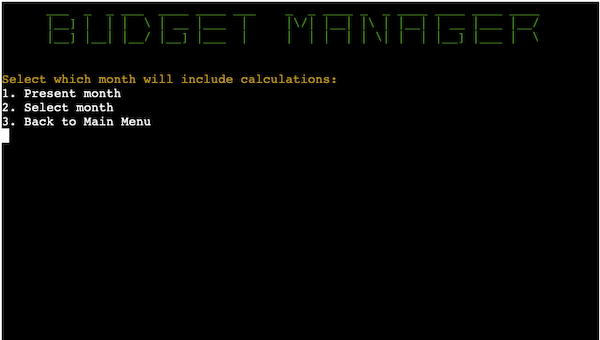
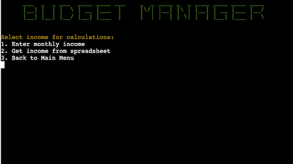
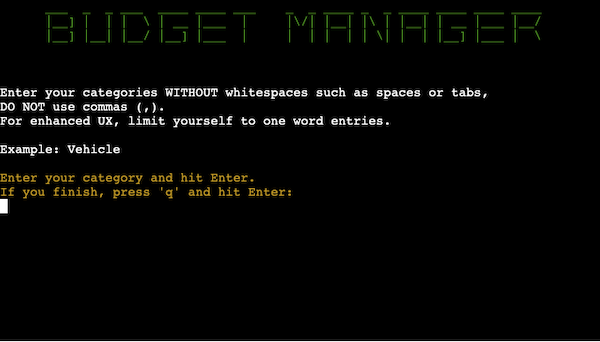
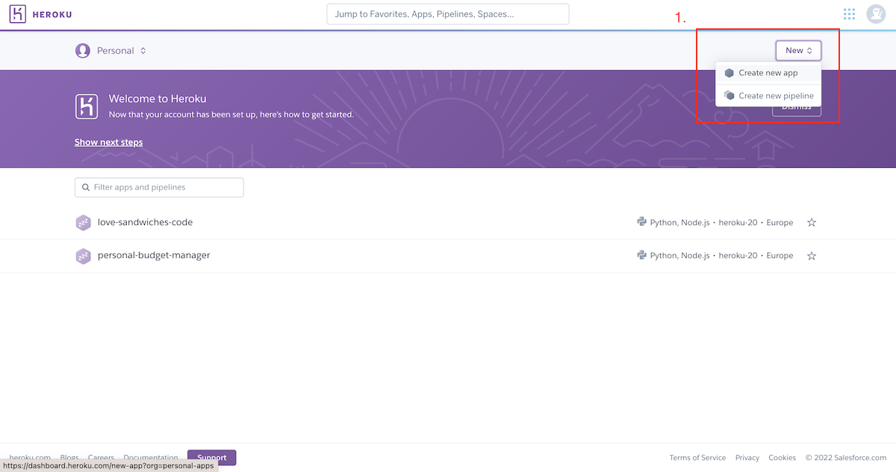

<h1 align="center">Personal Budget Manager</h1>

Personal Budget Manager is a product to plan monthly costs based on users’ income. It can be used by ordinary users to manage their money and to encourage for investing and saving.

The entire program runs in a terminal. Users can enter their income and plan their costs using two available investing plans. Money can be spread into default or custom categories. The program runs with Google Sheets which is used to store data in the spreadsheet.

All calculations are handled using [Python](https://www.python.org) language. Users enter data for processing and the result of calculation is returned in terminal or Google Sheets.

The program can be run [here](https://personal-budget-manager.herokuapp.com/).

The Google Sheets file for program operation can be found [here](https://docs.google.com/spreadsheets/d/19BHSAAJUUjRaPTcDJA9t2W7f-NtQhhcySJKf-Cu2uwE/edit?usp=sharing).

<h2 align="center"></h2>

# Contents
- [Contents](#contents)
- [User Experience](#user-experience)
  - [User Stories](#user-stories)
  - [Logic flow](#logic-flow)
  - [Program Structure](#program-structure)
    - [Colour](#colour)
- [Features](#features)
  - [Budget Plans](#budget-plans)
  - [Main Menu](#main-menu)
  - [Month Selection](#month-selection)
  - [Income Input](#income-input)
  - [Managing Categories for Needs/Wants](#managing-categories-for-needswants)
  - [Updating Needs/Wants Values](#updating-needswants-values)
  - [Budget Management](#budget-management)
  - [Future Features](#future-features)
- [Technologies Used](#technologies-used)
  - [Third Party Libraries](#third-party-libraries)
- [Testing](#testing)
- [Deployment](#deployment)
  - [Using Heroku to deploy the project](#using-heroku-to-deploy-the-project)
  - [Fork a repository](#fork-a-repository)
  - [Clone a repository](#clone-a-repository)
- [Credits](#credits)
  - [Content](#content)
- [Acknowledgements](#acknowledgements)

# User Experience
## User Stories
-	As a user, I want to automate my budget calculations.
-	As a user, I want to have access to my data.
-	As a user, I want to edit my data if needed.
-	As a user, I want to run my program without crashing.
-	As a user, I want to be notified if I exceeded my budget.
-	As a user, I want to handle my debt if I exceed my budget.

## Logic flow
Logic flow was presented using [Lucidchart](https://www.lucidchart.com/pages/) to visualize how the program will run. The outcome differs from original concept due to complexity of program.

## Program Structure
Personal Budget Manager is run in terminal and Google Sheets. Users input data through selection based on menu provided or by typing. All inputs are validated for proper program operation.

### Colour
Third party library [termcolor](https://pypi.org/project/termcolor/) was used to colour title heading in the terminal for enhanced UX. 

Main title/logo is green - inspired by "the Matrix" movie.

'Needs' worksheet entries are in red - to focus attention on essential spends.

'Wants' worksheet entries are in green - to give contrast to 'Needs' entries, this category should be secondary.

# Features

## Budget Plans
This program is built on two budgeting plans. Rules originate from the 2005 book, “All Your Worth: The Ultimate Lifetime Money Plan,” written by current US Senator Elizabeth Warren and her daughter, Amelia Warren Tyagi. 

Elements for both plans consist of:

- **Needs** - expenses that you can’t avoid—payments for all the essentials that would be difficult to live without. Needs may include:
  - Monthly rent
  - Electricity and gas bills
  - Transportation
  - Insurances (for healthcare, car, or pets)
  - Minimum loan repayments
  - Basic groceries

- **Wants** - defined as non-essential expenses—things that you choose to spend your money on, although you could live without them if you had to. These may include:
  - Dining out
  - Clothes shopping
  - Holidays
  - Gym membership
  - Entertainment subscriptions (Netflix, HBO, Amazon Prime)
  - Groceries (other than the essentials)

- **Savings** - defined as money to achieve your savings goals or paying back any outstanding debts.

Users can select one of two available budgeting plans, where they allocate their income (after TAX)  in proportion:

1. **50/30/20** - 50% goes to **Needs**, 30% goes to **Wants**, 20% goes to **Savings**,

2. **70/20/10** - 70% goes to **Needs**, 20% goes to **Wants**, 10% goes to **Savings**.

## Main Menu
The main menu is loaded when program starts and when users decide to restart.

1. **About the app** - this section can be accessed through main menu. It provides users with program operation brief description.

2. **Print tables** - users can see the most recently updated worksheets: General, Needs or Wants depending on the input.

3. **Manage the budget** - this section is starting point for all budget calculations. Step by step users are prompt to enter the data which will be handled depending on their choice.

4. **Exit** - if users decide to leave the program he can choose Exit and the program will be stopped.

## Month Selection

Users are prompted to select month for their calculations:
1. **Present month** - calculations will be handled using Python datetime library to get present month from system.
2. **Select month** - users can select month for their calculations. The input is validated with list of months. If users put invalid entry, the message is printed.

## Income Input

Users are prompted to enter their monthly income:
1. **Enter monthly income** - users input income manually. Input is validated - only float data type is allowed.
2. **Get income from spreadsheet** - data is fetched from worksheet based on last entry. If the field is empty, the message will pop-up informing users that their entry is not valid, and they will need to enter income manually.

## Managing Categories for Needs/Wants

**Important Note!**
All procedures after **Income Input** are almost identical for Needs and Wants. After successfully completing managing the budget for Needs, users go through the same steps for Wants. Users are intentionally not allowed to first work on Wants budget and then on Needs - Wants what should be considered only if Needs costs are covered for the month. 
The amount of money available to spend on Needs or Wants depends on the selected budget plan.

Users are prompted to choose from the menu how categories will be handled in later calculations and updated in the Google Sheets file. These categories are top row in Google Sheets spreadsheet, respectively for Needs and Wants worksheets:
1. **Default Categories** - users can select to use default categories. These categories are defined in the source code and are as follows:
   - Needs: Housing, Vehicle, Insurance, Food, Banking.
   - Wants: Entertainment, Wellbeing, Travel
2. **Customize Categories** - users can type their own categories in a loop structured entry . 

The input is restricted for proper program operation:
   - Only string data is allowed,
   - The categories must be entered without whitespaces and commas (,),
   - Blank entry is not allowed.
When users decide to finish their entries, they must type 'q' and hit Enter to exit the loop.
3. **Get Categories from Spreadsheet** - users can choose to use categories fetched from spreadsheet. This option allows to re-enter values to previously determined entries.

**IMPORTANT NOTE!**
Both *'Default Categories'* and *'Customize Categories'* options will erase all inputs in selected worksheet. This is necessary for proper alignment of columns if users decide to enter more/less categories for different months.
Before erasing the worksheet, users will be warned and prompted to accept or reject this operation.

## Updating Needs/Wants Values

This part appears after user's decision about handling categories.
The top message includes amount of money users are allowed to spend for relevant section. The value is updated every time users make entries for category of their choice made in previous call.

Only float entries are allowed, other data type will be rejected with relevant message displayed in the terminal.

After successful entries the spreadsheet will be updated with passed values and users will be informed of how much they spent on relevant section.

## Budget Management
After users’ complete value entries, the program will check what is the surplus of total costs for Needs or Wants:
1. **Negative Surplus**

If **Surplus** is **negative**, the value of Savings will be checked to cover the difference. 
  - If this is still not enough, users are prompted to evaluate their spending. From this point users can go back to Main Menu or exit the program.
  - If Savings value can cover the debt, then Savings will transfer to Surplus.
2. **Positive Surplus**

If **Surplus** is **positive**, users can decide where to allocate their money. Available options are as follows:
  - **Savings** - money will be added to Savings cell in 'general' worksheet.
  - **Extra Money** - money will be added to Extra cell in 'general' worksheet.
Extra cell was made to allow users to collect their extra money if they did their budget properly. It is award users can spend to glorify their success.

## Future Features
1. Add 'Go Back/Previous Step' option to allow users to re-enter previously visit page.
2. This project is based on one spreadsheet for all. In future this project could be restructured to create spreadsheets for all users.

# Technologies Used
- [Python](https://www.python.org) - interpreted high-level general-purpose programming language used to build the entire application.
- [Gitpod](https://www.gitpod.io/#get-started) - cloud development platform to deploy website.
- [Github](https://github.com/) - code hosting platform to host the website.
- [Heroku](https://www.heroku.com) - container-based cloud Platform as a Service (PaaS). Developers use Heroku to deploy, manage, and scale modern apps.
- [LucidChart](https://www.lucidchart.com/) - intelligent diagramming application to create logic flow diagram.

## Third Party Libraries
- [Gspread / Google Auth](https://docs.gspread.org/en/latest/oauth2.html) - to create API for Google Sheets spreadsheet
- [Pyfiglet](https://pypi.org/project/pyfiglet/0.7/) - to create program's main title in terminal
- [Termcolor](https://pypi.org/project/termcolor/) - to add coloured text in terminal
- [PyInputPlus](https://pypi.org/project/PyInputPlus/) - to automate users inputs validation
- [PrettyTable](https://pypi.org/project/prettytable/) - to generate table in terminal

# Testing
All various test results are presented in separate [TESTING](TESTING.md) file.

# Deployment
## Using Heroku to deploy the project
This project was deployed using [Heroku](https://dashboard.heroku.com/) using following steps:
1. Click on *New* in top-right corner and then *Create New App*.

2. In the next page give app the unique name.
3. Choose region (USA or Europe).
4. Click *Create app*.

5. In the next page click in *Settings* tab.
6. In the Settings page open *Config Vars* and add *CREDS* and *PORT* vars.

7. Below *Config Vars* click *Add Buildpack* to add *Python* and *NodeJS* buildpacks (the order is important: Python on top of Node.js)

8. Click on *Deploy* tab.
9. In the *Deploy* page in the *Deployment Method* select GitHub.
10. After successful connection to GitHub locate your repository and add it to Heroku.

11. In *Manual Deploy* section confirm *main* branch is selected and click *Deploy Branch*

The live link can be found here - [Personal Budget Manager](https://personal-budget-manager.herokuapp.com/).

## Fork a repository
A fork is a copy of a repository. Forking a repository allows you to freely experiment with changes without affecting the original project. The steps are as follows:
1. On the GitHub.com navigate to repository page.
2. In the top-right corner of the page, click **Fork**.

You can fork a repository to create a copy of the repository and make changes without affecting the upstream repository.
## Clone a repository
In GitHub you have option to create a local copy (clone) of your repository on your device hard drive. The steps are as follows:
1. On the GitHub.com navigate to repository page.
2. Locate the *Code* tab and click on it.
3. In the expanded window, click the two squares icon to copy https link of the repository.

4. On your computer, open **Terminal**.
5. Navigate to the directory of choice.
6. Type **git clone** and paste the copied link of the repository.
7. Press **Enter** and the local clone of the repository will be created in the selected directory.

# Credits
## Content
- The program structure and layout were inspired by Code Institute student project [Vaccination Manager](https://github.com/neil314159/portfolio-project-3) by 'neil314159'.
- .env file soulution to fix pylint import error come from [Stack Overflow](https://stackoverflow.com/questions/48973742/proper-relative-imports-unable-to-import-module).
- The budgeting plan section of README is taken from [n26 Digital Bank](https://n26.com/en-eu/blog/50-30-20-rule).
- Setting up the Google APIs origin is [Code Institute](https://codeinstitute.net/) 'Love Sandwiches' Essential Project.
- README and TESTING files text grammar and typing were checked using [Microsoft Word](https://www.microsoft.com/pl-pl/microsoft-365/word).
- GitHub Deployment section come from [GitHub Docs](https://docs.github.com/en/get-started/quickstart/fork-a-repo).

# Acknowledgements
Personal Budget application was created as part of [Code Institute](https://codeinstitute.net/) Full Stack Software Developer (e-Commerce) Diploma. I would like to express my gratitude and appreciation to my mentor [Precious Ijege](https://www.linkedin.com/in/precious-ijege-908a00168/) for his guidance on this project and flexibility with arranging sessions, [Code Institute](https://codeinstitute.net/) support team to always be there in case of need and fellow students for being in this learning journey together.

Milosz Misiek 2022
