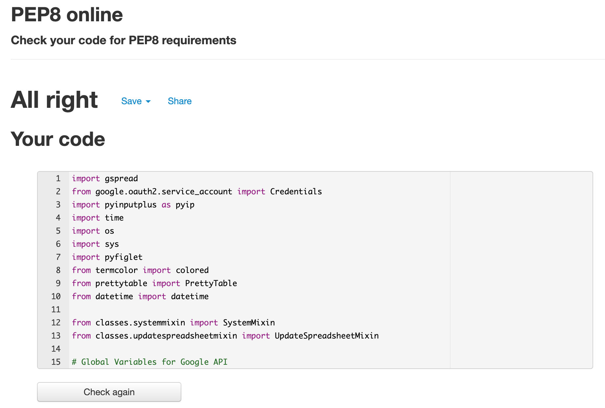

The program is constructed using Python technology.
Testing was completed using [PEP8 Validator](http://pep8online.com/).

# PEP8 Validation
All modules were tested using PEP8 Validator. Most of bugs were related to line length (> 80 characters), trailing whitespace or too few blank lines. After validation the final code in all modules were founded with no warnings.

The file with first validation can be found [here](docs/testing-files/pep8-example-validation.txt).

# Code Validation
All users’ inputs are validated with third party library [PyInputPlus](https://pypi.org/project/PyInputPlus/).
The library automates validation, so no further code structure is required.

# Try/Except Function
Parts of the code required extra validation using Python built-in method *try/except*.

# Known Bugs
Most of bugs were found using [PEP8 Validator](http://pep8online.com/) which are documented in section above. During code development all bugs were caught during development process.
