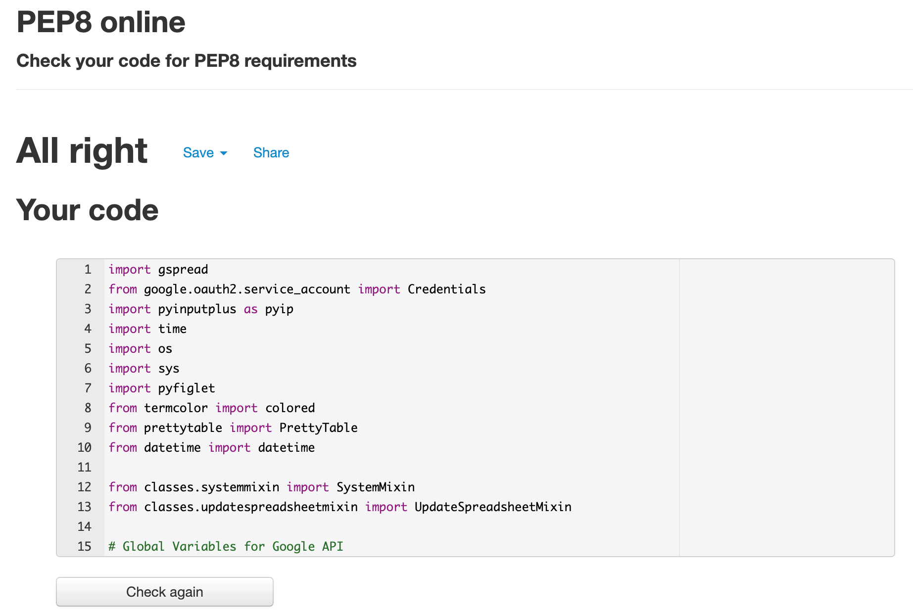

# Testing User Stories
-	As a user, I want to handle automate my budget calculations.
    - All calculations for budgeting can be handled using only Python program.
-	As a user, I want to have access to my data.
    - User can print spreadsheet tables in terminal in *Main Menu*. Values for *Needs* and *Wants* are printed and updated in terminal every time user makes an input for his categories.
-	As a user, I want to edit my data if needed.
    - This program allows users to enter data for previous or future months in case users would like to predict/check their budget.
-	As a user, I want to run my program without crashing.
    - Validation was automated mainly using third party libraries
-	As a user, I want to be notified if I exceeded my budget.
    - Users are not allowed to enter 'Wants' data if 'Needs' (which are ESSENTIAL) are not met. 
-	As a user, I want to handle my debt if I exceed my budget.
    - If users have done bad management of their budget, the program will check Savings and if there is enough money it will cover the debt. If the Surplus is exceeding users Savings, the message will be printed to inform about it.

# PEP8 Validation
The program is constructed using Python technology.
Testing was completed using [PEP8 Validator](http://pep8online.com/).

All modules were tested using PEP8 Validator. Most of bugs were related to line length (> 80 characters), trailing whitespace or too few blank lines. After validation the final code in all modules were founded with no warnings.

The file with first validation can be found [here](docs/testing-files/pep8-example-validation.txt).

# Code Validation
All users’ inputs are validated with third party library [PyInputPlus](https://pypi.org/project/PyInputPlus/).
The library automates validation, so no further code structure is required.

# Try/Except Function
Parts of the code required extra validation using Python built-in method *try/except*.

# Known Bugs
Most of bugs were found using [PEP8 Validator](http://pep8online.com/) which are documented in section above. During code development all bugs were caught during development process.
